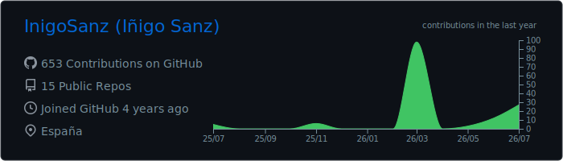
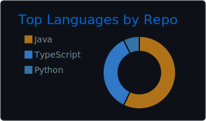
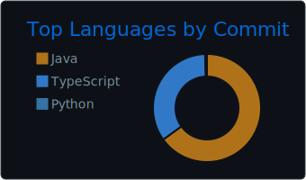
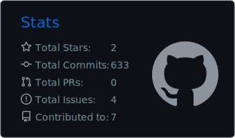
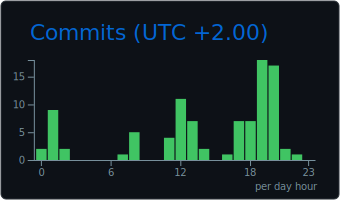

# Hi, I'm Iñigo Sanz 👋

**Software Developer** focused on Spring Boot, REST APIs, microservices, and AI integrations.

I build full-stack applications, developer tooling and AI-assisted automation for real business workflows.

📍 Navarra, Spain  
🎓 Computer Science Engineer  
📜 Master's Degree in Full Stack Development  

[Portfolio](https://inigosanz.vercel.app/) · [LinkedIn](https://www.linkedin.com/in/i%C3%B1igo-sanz-delgado-854751164/) · [Email](mailto:i.sanzdelg@gmail.com)

## About me

- Backend development with **Java and Spring Boot**
- REST APIs, microservices and **hexagonal architecture**
- Authentication, authorization and application security
- Relational and NoSQL databases
- Full-stack development with **Angular, React and TypeScript**
- Applied AI, LLM integrations and process automation
- Observability and engineering tooling

## Technology stack

  

| Area | Technologies |
|---|---|
| **Backend** | Java, Spring Boot, REST APIs, MapStruct |
| **Architecture** | Microservices, Hexagonal Architecture, Ports and Adapters |
| **Databases** | PostgreSQL, MongoDB, SQL, Qdrant |
| **Frontend** | Angular, TypeScript, JavaScript, HTML, CSS |
| **AI & automation** | Python, LLM integrations, RAG, workflow automation |
| **DevOps & quality** | Git, Jenkins, Docker, Postman |
| **Observability & collaboration** | Grafana, InfluxDB, Jira |

## Featured projects

### 🌌 [Nebula](https://github.com/InigoSanz/nebula-project-manager)

Local visual project manager that detects Git repositories and represents them as procedural 3D orbs based on their languages, complexity and recent activity.

It combines live Git information, project tasks, AI coding-agent sessions and optional integrations with Jira, Microsoft Planner, Graphify and Obsidian.

**Stack:** TypeScript, React, Fastify, WebSocket, SQLite, Three.js, React Three Fiber

 

### 🌐 [Accessibility Copilot](https://github.com/InigoSanz/accessibility-copilot)

Full-stack platform for auditing web accessibility on public sites, running automated scans and reviewing WCAG issues from a dedicated interface.

The backend performs asynchronous scans with Playwright and axe-core, persists results in PostgreSQL and exposes an OpenAPI contract consumed by the Angular frontend.

**Stack:** Java 21, Spring Boot, Angular 21, PostgreSQL, Playwright, axe-core, Flyway, Docker, GitHub Actions

 

### 📅 GetaBreak — Employee Vacation Management

Full-stack application developed as my Master's Thesis to manage employee vacation requests, role-based workflows, approvals, employee administration and shared calendars.

- [Backend repository](https://github.com/InigoSanz/TFM-Backend)
- [Frontend repository](https://github.com/InigoSanz/TFM-Frontend)

**Stack:** Java 21, Spring Boot, MongoDB, Hexagonal Architecture, Angular, TypeScript, RxJS, FullCalendar

 

### 🧪 [ACTIVUS](https://github.com/InigoSanz/ACTIVUS)

Academic web application for analysing compatibility between medicines based on their active ingredients.

It includes user roles, authentication, medicine management, multilingual support and a separate Python API for the compatibility analysis.

**Stack:** Java 17, Spring Boot, Spring Security, Spring Data JPA, MySQL, Thymeleaf, Flask, Pandas

> ACTIVUS is an academic and technical demonstration. It must not be used for clinical decisions.

## GitHub activity

  

  
  

  
  

## Contact

- **Portfolio:** [inigosanz.vercel.app](https://inigosanz.vercel.app/)
- **LinkedIn:** [Iñigo Sanz Delgado](https://www.linkedin.com/in/i%C3%B1igo-sanz-delgado-854751164/)
- **Email:** [i.sanzdelg@gmail.com](mailto:i.sanzdelg@gmail.com)

---

⭐ From [InigoSanz](https://github.com/InigoSanz)
